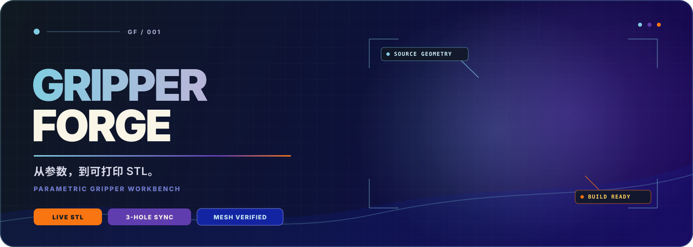
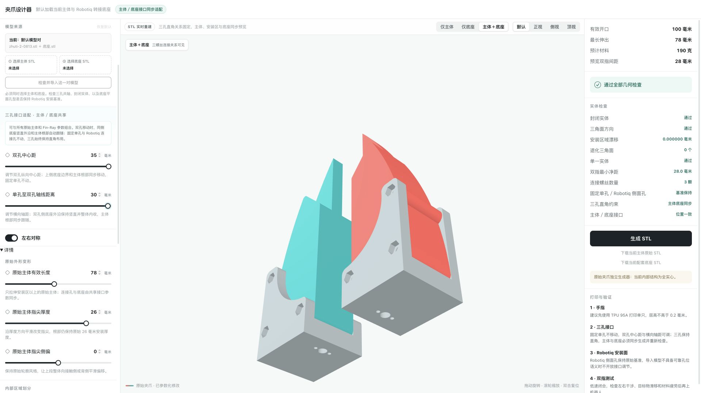

<div align="center">
  
</div>

<div align="center">
  <br />
  
  
  
  
</div>

<p align="center">
  <strong>在浏览器里改变夹爪几何，并实时得到主体与转接底座完全匹配的可打印 STL。</strong>
  <br />
  <sub>参数不是视觉特效。每一次变化都由真实网格生成、接口同步与几何检查支撑。</sub>
</p>

---

## ◈ 实时演示

<div align="center">
  
  <br />
  <sub>原始夹爪变形 → 三孔接口联动 → Fin-Ray 模板切换 → 返回初始状态</sub>
</div>

---

## ◇ 它解决什么

传统 STL 修改通常意味着：回到 CAD、重新找特征、重新对孔、重新导出，然后再担心底座是否还能装上。

Gripper Forge 把这条链路压缩成一个浏览器工作台：

<table>
  <tr>
    <td width="25%" align="center"><strong>⚡ 实时网格</strong><br/><sub>拖动参数时连续重建真实 STL，当前视角保持不动</sub></td>
    <td width="25%" align="center"><strong>⌁ 接口联动</strong><br/><sub>主体、三孔安装区与底座共享同一组接口参数</sub></td>
    <td width="25%" align="center"><strong>◈ 双生成器</strong><br/><sub>原始夹爪与 Fin-Ray 拥有互不干扰的参数状态</sub></td>
    <td width="25%" align="center"><strong>✓ 几何闸门</strong><br/><sub>封闭性、方向、退化面、单实体与孔位全部检查</sub></td>
  </tr>
</table>

```text
参数输入
   │
   ├──► 主体网格 ──┐
   │               ├──► 接口一致性 ──► 几何检查 ──► STL / ZIP
   └──► 底座网格 ──┘
          ▲
          └──── 三孔始终保持直角布局；固定连接特征不漂移
```

## ◆ 功能地图

| 区域 | 能力 |
|---|---|
| **原始夹爪** | 有效长度、指尖厚度、侧偏；全实心／尖端伪 Fin-Ray／后段伪 Fin-Ray／双区域四种内部结构 |
| **Fin-Ray** | 默认、防滑纹、圆物托槽、指甲薄片；长度、内扣、外壁、肋条和接触特征独立控制 |
| **三孔接口** | 双孔中心距与单孔至双孔轴线距离可调；底座外边界和主体根部同步跟随 |
| **双指设计** | 左右对称一键同步，也可分别编辑手指 A / B |
| **模型来源** | 默认加载主体与底座模板；支持成对导入 STL 并检查接口是否匹配 |
| **三维预览** | 仅主体、仅底座、主体＋底座；自由旋转、缩放、四个标准视角 |
| **交付** | 单只或双指 STL、匹配底座、完整 ZIP 打印包 |

## ⌁ 几何契约

这里最重要的不是“能变”，而是**变化之后仍然能装**。

| 不变量 | 约束 |
|---|---|
| 固定单孔 | 坐标保持不变 |
| 同线双孔 | 始终位于同一轴线 |
| 三孔关系 | 始终构成直角布局 |
| 主体 ↔ 底座 | 孔轴位置同步，接口偏差要求为 `0.000000 mm` |
| 固定连接面 | 原始侧面连接特征保持基准 |
| 网格质量 | 封闭、方向一致、零退化面、单一实体、正体积 |

> 修改三颗连接螺丝的相对位置时，主体和底座必须同时生成。任何一侧无法同步，导出都会被拒绝。

<details>
<summary><strong>导入 STL 时会检查什么？</strong></summary>

导入模型必须以“主体 + 底座”成对提供。系统会检查：

- 两个网格是否为封闭实体；
- 是否各自识别到三颗安装孔；
- 三条孔轴是否共轴；
- 底座固定连接特征和外形基准是否保留；
- 当前导入模型是否具备继续参数化所需的可靠几何语义。

检查失败的模型仍可组合预览以便排查，但不会被冒险当作可编辑模型继续导出。

</details>

## ▣ 技术结构

```text
Gripper-Forge/
├── app/       浏览器界面 · Three.js 预览 · 参数状态
├── backend/   STL 生成 · 布尔几何 · 检查 · 导入导出 API
├── public/    默认主体与机器人夹爪转接底座 STL
├── tests/     几何测试 · 参数矩阵 · 前端能力契约
├── db/        可选持久化数据结构
└── worker/    部署运行入口
```

**前端**使用 React、Three.js 与 Vinext；**几何服务**使用 FastAPI、Trimesh、Shapely 与 Manifold3D。实时预览通过一次请求返回主体与底座的紧凑二进制 STL 包，浏览器只保留一个进行中的请求，并自动跳过已经过时的中间状态。

## ▶ 快速启动

需要 **Node.js 20+** 与 **Python 3.12**。

```bash
git clone https://github.com/Nahuyiur/Gripper-Forge.git
cd Gripper-Forge

npm install
python3.12 -m venv .venv
.venv/bin/python -m pip install -r requirements.txt

npm run dev:all
```

| 服务 | 地址 |
|---|---|
| 设计器 | `http://localhost:3000/` |
| 几何 API | `http://127.0.0.1:8787/` |

## ✓ 验收

```bash
npm run lint
npm test
```

完整测试覆盖：

- `74` 项后端几何、接口、导入导出和生成回环测试；
- `10` 项前端能力、实时 STL 协议和交互契约测试；
- 两套生成器各 `160` 组确定性参数组合；
- Fin-Ray `14` 个控件和原始夹爪 `11` 个独立控件的逐项有效性；
- 全低、全高、交错极值、四种内部结构和左右非对称场景。

<details>
<summary><strong>数字检查通过意味着什么？</strong></summary>

通过代表网格与安装接口的数字几何约束满足要求，**不等于完成实物装配与抓取验证**。首次打印仍应测量孔距、进行试装、低速闭合，并检查材料疲劳与目标物滑移。

</details>

## ◉ 设计边界

- 原始夹爪和 Fin-Ray 是两套独立生成器；调整原始夹爪不会突然切换成 Fin-Ray。
- 默认模型对始终可恢复，临时导入不会覆盖下一次启动的默认状态。
- 外形参数、内部中空程度、尖端伪 Fin-Ray 与后段伪 Fin-Ray 可以独立组合。
- 公开参考仅用于理解参数化交互方式；本项目的几何生成、接口同步和检查链路均为独立实现。

## ◌ 版本约定

- `main` 只保存通过完整自动化测试的稳定版本；
- 稳定版本使用 `v主版本.次版本.修订版本` 标签；
- 涉及几何逻辑的版本必须同时验证浏览器预览、最终导出 STL、主体／底座接口和固定连接特征。

<div align="center">
  <br />
  <strong>Shape it. Verify it. Print it.</strong>
  <br />
  <sub>GRIPPER FORGE · PARAMETRIC DESIGN STATION</sub>
</div>
